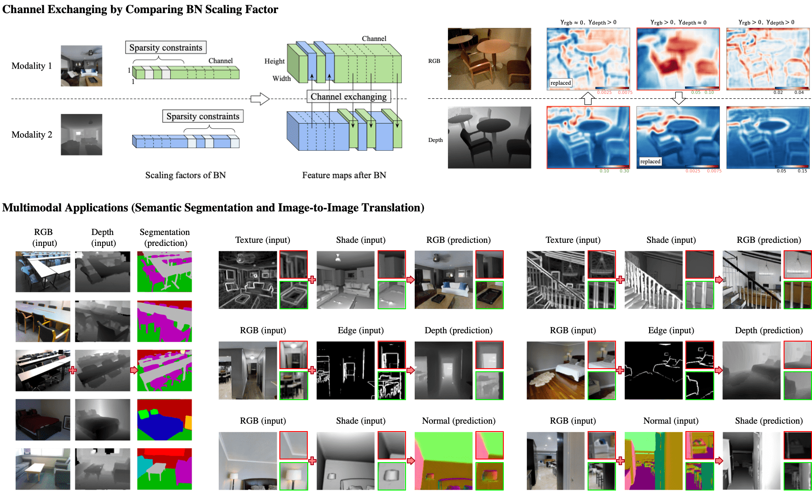

# Deep Multimodal Fusion by Channel Exchanging

By Yikai Wang, Wenbing Huang, Fuchun Sun, Tingyang Xu, Yu Rong, Junzhou Huang.

[**[Paper]**](https://papers.nips.cc/paper/2020/file/339a18def9898dd60a634b2ad8fbbd58-Paper.pdf) [**[Paper & Appendix]** (with proofs and visualizations)](https://arxiv.org/pdf/2011.05005.pdf)

[[Slides]](https://yikaiw.github.io/projects/NeurIPS20-CEN/slides.pdf) [[Poster]](https://yikaiw.github.io/projects/NeurIPS20-CEN/poster.pdf) [[BibTex]](https://yikaiw.github.io/projects/NeurIPS20-CEN/cite.txt)

This repository is an official PyTorch implementation of "Deep Multimodal Fusion by Channel Exchanging", in NeurIPS 2020. The basic method and applications are introduced as belows:

<p align="center"></p>


If you find our work useful for your research, please consider citing the following paper.
```
@inproceedings{wang2020cen,
  title={Deep Multimodal Fusion by Channel Exchanging},
  author={Wang, Yikai and Huang, Wenbing and Sun, Fuchun and Xu, Tingyang and Rong, Yu and Huang, Junzhou},
  booktitle = {Advances in Neural Information Processing Systems (NeurIPS)},
  year={2020}
}
```

## Dependencies

```
python>=3.6
pytorch>=1.0.0
scikit-learn>=0.20.2
opencv-python>=4.0
```

## Datasets

For semantic segmentation task on NYUDv2 ([official dataset](https://cs.nyu.edu/~silberman/datasets/nyu_depth_v2.html)), we provide a link to download the dataset [here](https://drive.google.com/drive/folders/1mXmOXVsd5l9-gYHk92Wpn6AcKAbE0m3X?usp=sharing). The provided dataset is originally preprocessed in this [repository](https://github.com/DrSleep/light-weight-refinenet), and we add depth data in it.

For image-to-image translation task, we use the sample dataset of [Taskonomy](http://taskonomy.stanford.edu/), where a link to download the sample dataset is [here](https://github.com/alexsax/taskonomy-sample-model-1.git).

Please modify the data paths in the codes, where we add comments 'Modify data path'.


## Semantic Segmentation


First, 
```
cd semantic_segmentation
```
Training script for segmentation with RGB and Depth input, the default setting uses RefineNet (ResNet101),
```
python main.py --gpu 0 -c exp_name  # or --gpu 0 1 2
```
Evaluation script,
```
python main.py --gpu 0 --resume path_to_pth --evaluate  # optionally use --save-img to visualize results
```

Checkpoint models, training logs and the **single-scale** performance on NYUDv2 (with RefineNet) are provided as follows:

| Backbone | Pixel Acc. (%) | Mean Acc. (%) | Mean IoU (%) | Download | 
|:-----------:|:-----------:|:-----------:|:-----------:|:-----------:|
| ResNet101 | 76.2 | 62.8 | 51.1 | [Google Drive](https://drive.google.com/drive/folders/1wim_cBG-HW0bdipwA1UbnGeDwjldPIwV?usp=sharing)|
| ResNet152 | 77.0 | 64.4 | 51.6 | [Google Drive](https://drive.google.com/drive/folders/1DGF6vHLDgBgLrdUNJOLYdoXCuEKbIuRs?usp=sharing)|


## Image-to-Image Translation

First, 
```
cd image2image_translation
```
Training script, an example of translation from Shade (2) and Texture (7) to RGB (0) (could reach 62~63 FID score),
```
python main.py --gpu 0 --img-types 2 7 0 -c exp_name
```
This script will auto-evaluate on the validation dataset every 5 training epochs. 

Predicted images will be automatically saved during training, in the following folder structure:

```
code_root/ckpt/exp_name/results
  ├── input0  # 1st modality input
  ├── input1  # 2nd modality input
  ├── fake0   # 1st branch output 
  ├── fake1   # 2nd branch output
  ├── fake2   # ensemble output
  ├── best    # current best output
  │    ├── fake0
  │    ├── fake1
  │    └── fake2
  └── real    # ground truth output
```

For training with other modalities, the index for each img-type is described as belows, and also in Line 69 of ```main.py```.
```
0: 'rgb', 1: 'normal', 2: 'reshading', 3: 'depth_euclidean', 
4: 'depth_zbuffer', 5: 'principal_curvature', 6: 'edge_occlusion', 
7: 'edge_texture', 8: 'segment_unsup2d', 9: 'segment_unsup25d'
```

Full quantitative results are referred to the paper.

## License

CEN is released under MIT License.
